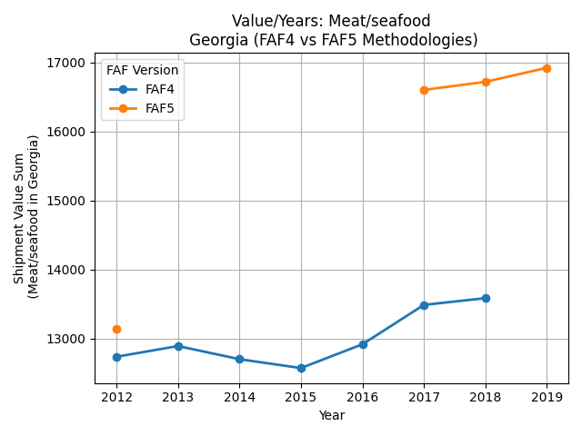
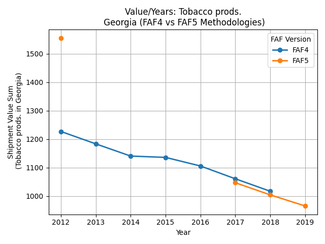
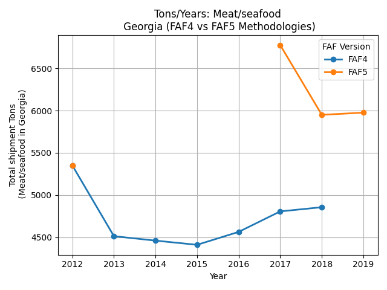
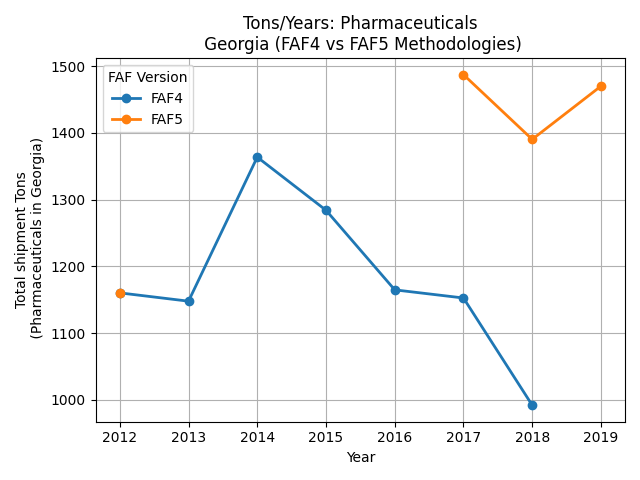
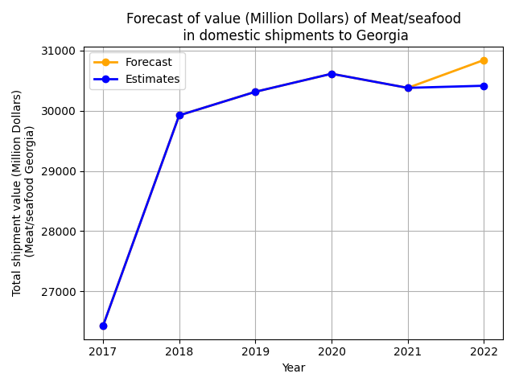
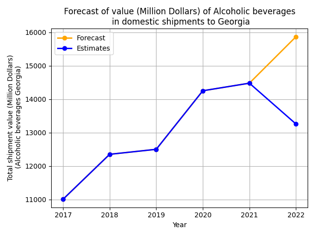
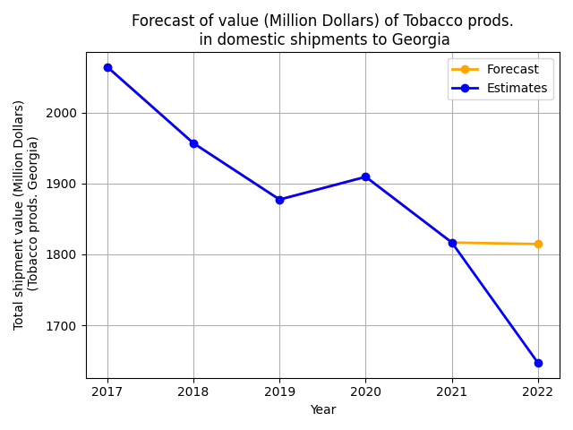
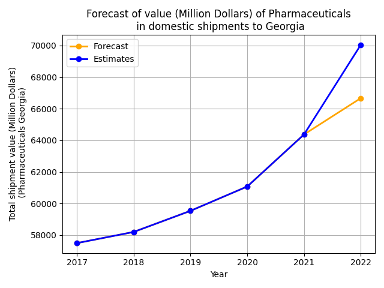
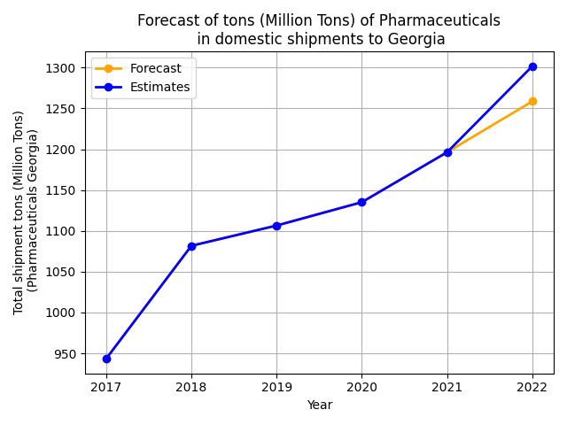

## Day 1 (June 8, 2025)
- Downloaded FAF5.6.1 State Database (2018-2023) from [Bureau of Transportation Statistics](https://www.bts.gov/faf)
- Reading and exploring metadata using 'bts_freight_eda.ipynb'.
- Selected data based on state (Georgia) and trade type (Domestic).
- Attempting to select data based on specific commodity types.
- **Blockers:** Need a companion dataset for some sort of yearly analysis.
- **Tomorrow:** Explore using commodity types and import Customer related data from Georgia

## Day 2 (June 9, 2025)
- Selected 4 customer oriented commodities.
- Using [Federal Reserve Economic Data](https://fred.stlouisfed.org/) for income data and [US Census Bureau](https://data.census.gov/) for population data.
- For household/median income [FRED, Real Median Household Income by State, Annual](https://fred.stlouisfed.org/series/MEHOINUSGAA672N)
- Including retail sales [FRED, Monthly State Retail Sales](https://fred.stlouisfed.org/release?rid=477&soid=19&t=ga&ob=pv&od=desc)
- US Census, State Annual Estimate of Population [2010-2019](https://www.census.gov/data/datasets/time-series/demo/popest/2010s-state-total.html) and [2020-2024](https://www.census.gov/data/datasets/time-series/demo/popest/2020s-state-total.html).
- Joined the three tables for Georgia between years.
- Restructure shipment data to inbound and outbound domestic for each commodity and select only inbound for analysis of customer-oriented commodities.
- Restructuring the metrics (ton, value) and the year in a way that allows join with income/population data.
- Fixed datetime errors before joining the tables.
- **Blockers:** 
- **Tomorrow:** Recheck all units and then regression analysis.

## Day 3 (June 10, 2025)
- Modifying median income unit from dollars to millions of dollars.
- Removing median income not adjusted for inflation.
- Obtained correlation matrix for commodity types to the 3 features.
- Missed dataset for year 2017 and projections till 2050, adding that to extend the dataset.
- Not all years available, usable only years 2007, 2012, 2017.
- **Tomorrow:** 
- Decision support system: Which commodities will grow fastest based on the given 3 features?

## Day 4 (June 11, 2025)
- Making a separate script to clean data and save into csv for easy reading.
- Added State population estimate for [2000-2010](https://www.census.gov/data/datasets/time-series/demo/popest/intercensal-2000-2010-state.html)
- Found FAF data between [2013-2018](https://www.bts.gov/faf/faf4)
**Tomorrow** Continue cleaning up data and visualize time-series data.

## Day 5 (June 13, 2025)
- Continuing to integrate more data from 2013-2018, the size is slowing things down a bit. Looking to filter columns in each dataframe before concatenating.
**Blockers:** Index issues due to differently named columns.

## Day 6 (June 14, 2025)
- While combining FAF4 and 5, I have to account for the inflation-adjusted $ value to be different. This would require me to convert one of them to the other.
- Require [GDP Implicit Price Deflator](https://fred.stlouisfed.org/series/A191RD3A086NBEA#) data for 2017 base data. Will be using 2017 base dollar value for the overall dataset (future years are estimations from 2017).
- To convert constant dollar values from one base year to another, you can use the following formula:

    

- Obtained a cleaned csv with adjusted value for 2017 base. There is however a big gap between estimated 2016 value and base 2017 value.
**Tomorrow:** Visualizations and analysis on the cleaned data.

## Day 7 (June 17, 2025)
- Added visualizations of value and commodity groups across 2012-2023.
- Adding lagged value as a feature: value_commodity_t-1 and tons_commodity_t-1.
- Will set aside 2023 row for prediction and delete 2012 due to lack of lagged feature.
- Separate data processing after the cleaned data on "forecast_prep.py" saved in "forecast_prep.csv".
- Due to lack of 2024, 2025 data for some of the features (income and retail trade GDP), 
plan is to do a rolling validation.
- Train the model on 2012-2018 predict 2019, 2012-2019 predict 2020 etc.
- Set up training data for training first model (expected value of commodity group 5, meat/seafood).
- **Tomorrow:** Figure out how to use ARIMA.

## Day 8 (June 18, 2025)
- Understanding ARIMA model order (p, d, q) and fixing errors while model fitting and testing.
- Predictions are way off, high error rate.

## Day 9 (June 19, 2025)
- Examining the trend for value_5 there is a gap between base 2012 and base 2017.
- Considering using a scaling factor to join FAF4 and FAF5 data.
- May have misunderstood the reprocessed data, looking to see documentation for FAF4 and 5.

## Day 10 (June 20, 2025)
- The gap between the FAF4 and FAF5 estimates for the same year.

    

- Prepared functions for generating trends of value by commodity and adding more years for better visual clarity.
- Writing these functions as utils into ``visualization.py``.
- Moving data cleaning files into utils.
- Changed the folder structure to make it cleaner and more readable. Added the project structure to the README.

### Visualizations
| Commodity Code | Shipment Value by Commodity                                    |
|----------------|----------------------------------------------------------------|
| 5              |   |
| 8              |   |
| 9              |   |
| 21             |  |

## Day 11 (June 21, 2025)
- I wanted to go back and check whether I should have applied the GDP Implicit Price Deflator.
- Generated a new csv minus the inflation.
- From eye-test it doesn't seem to make a big difference, there is still a clear gap between 2016-2017.

| Commodity Code | Shipment Tons by Commodity                                    |
|----------------|---------------------------------------------------------------|
| 5              |   |
| 8              |   |
| 9              |   |
| 21             |  |

- Will move on and try to apply forecasting/trend analysis over 2017-2023 data instead to avoid the gap.
- Build the integration pipeline before coming back to address this issue.

## Day 12 (June 22, 2025)
- Removing rows before 2017.
- Just learned that ARIMA is used for single feature prediction while SARIMAX is used with multiple features.
- Added script for validation, metrics and visualizing results.
- Added ``config.py`` variables for easy access across all files (commodity mapping and predictive feature names).
- model_order was set to (1, 1, 1) due to the small training size.

#### Validation of trained SARIMAX (2017-2021) on 2022.

| Commodity Code          | Forecasting Value for Commodity                       |
|-------------------------|-------------------------------------------------------|
| 5 (Meat/Seafood)        |   |
| 8 (Alcoholic beverages) |   |
| 9 (Tobacco prods.)      |   |
| 21  (Pharmaceuticals)   |  |

| Commodity Code          | Forecasting Tons for Commodity                       |
|-------------------------|------------------------------------------------------|
| 5 (Meat/Seafood)        |   |
| 8 (Alcoholic beverages) |   |
| 9 (Tobacco prods.)      |   |
| 21 (Pharmaceuticals)    |  |

**Tomorrow:** Will start with integration - set up FastAPI project structure.

## Day 13 (June 23, 2025)
- Having trouble conceptualizing what the user will input when they attempt to use my forecasting tool.
- Option between letting the user input a period of data (say 2017:2022) and then giving me 
the 3 external feature data for 2023 and expecting a forecast, OR, providing only the 3 features and expecting
output for the very next year, the user then can only query for the year upto which model is trained.
- For now will keep it simpler and do a sequential prediction to the trained data -- Single-step ahead prediction.
- Created a subdirectory for api. Defined input types in "schemas.py". Defined forecast logic in ``routes.py``
Called them in ``main.py``. Setup forecast options for user in ``config.py``.
- Added /forecast POST endpoint using FastAPI.
- Allowing users to input word based label and converting that to the target_label parameter
using the mapping dictionary from config.
- Debugging errors at the moment with combining training data and user-input data.

## Day 14 (June 24, 2025)
- Running the API using
``
uvicorn api.main:app --reload
``
- Added unit conversions so that user can input features normally and then this is converted internally in "routes.py"
- Ran into some problems with running the API because the port 8000 seemed to be in the process from yesterday, tried killing it but didn't work.
Using port 8001 right now.
- Fixed errors and got a proper forecast as output from API.
- Had a problem with duplicate columns due to redundant processes in ``apply_scaler.py`` and ``routes.py`` which is fixed.
- Testing the "test_main.http" file and got ok response for all 3 (root, options and forecast).
- Adding error handling features.
- Checked Pharmaceuticals instead of Meat/seafood and tons as well and they all work in the forecast endpoint.
- Added `requirements.txt` and updated README with brief project description and instructions for using the API endpoints.
- Adding `form.html` in a new `templates/` folder to add a visual interface.
- Modified `main.py` to add the HTML template.
- Got the basic template running in `http://127.0.0.1:8000`.
- Updated gitignore to avoid larger csv files in `freight_data/raw` and updated `requirements.txt` to include all necessary libraries.

With this I think the basic project is working.
**Next Steps:** 
- UI Improvements, Adding success/failure message on submit, descriptions for input fields.
- Add more models for improvement of forecasting logic, maybe add multiple years of predictions, allow model switching.
- Storing predictions as a log.
- Containerize with Docker, deploy on a platform (Render, Heroku etc.).
- I've just realized there is another thing I've missed about the forecast prediction. So the dataset is working with 2017
Dollar value so any prediction will be adjusted to that year, so giving the output for 2022 will involve a conversion
to display on the user's end.